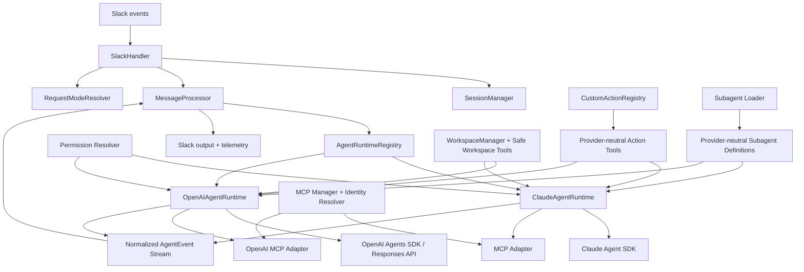

# Multi-Runtime Slack AI Agent: OpenAI Agents SDK Support

**Status:** Implementation design
**Target repository:** `mmizutani/slack-ai-agent` (fork of `duolingo/slack-ai-agent`)
**Baseline date:** 2026-08-23
**Primary language/runtime:** TypeScript / Node.js
**Primary objective:** Add first-class OpenAI Agents SDK + OpenAI API support while preserving Anthropic Claude Agent SDK support and existing Slack behavior.

---

## 1. Executive summary

The upstream Slack AI Agent is architecturally centered on the Claude Agent SDK. Claude-specific behavior is not isolated to `claude-handler.ts`; it leaks into message processing, session state, request-mode/model selection, MCP configuration, custom actions, subagents, file handling, smart-reply classification, telemetry naming, and sandbox assumptions.

The correct extension strategy is therefore **not** to add an `OpenAIHandler` beside `ClaudeHandler` and branch throughout the application. Instead, refactor the application around a provider-neutral agent runtime boundary, migrate the existing Claude implementation behind that boundary without changing behavior, then implement OpenAI Agents SDK as a second runtime.

The target architecture is:

```text
Slack events
   |
   v
SlackHandler
   |
   +--> SessionManager
   +--> RequestModeResolver
   +--> FileHandler / WorkspaceManager
   |
   v
MessageProcessor
   |
   v
AgentRuntimeRegistry
   |
   +---------------------------+
   |                           |
   v                           v
ClaudeAgentRuntime       OpenAIAgentRuntime
   |                           |
Claude Agent SDK          OpenAI Agents SDK
   |                           |
   +-------------+-------------+
                 |
                 v
       normalized AgentEvent stream
                 |
                 v
      Slack response / telemetry
```

The provider-neutral layer must own these contracts:

- runtime selection;
- model references and model capabilities;
- application conversation/session metadata;
- normalized streaming events;
- usage and terminal outcomes;
- MCP server definitions and per-request credential binding;
- role-based tool authorization;
- custom action tool definitions;
- subagent definitions;
- cancellation and retry semantics.

The first OpenAI implementation should use the normal `Agent`/`Runner` path from `@openai/agents` with the Responses API, not the beta `SandboxAgent` as a required dependency. OpenAI workspace access needed for Slack attachments should initially be provided through narrowly scoped provider-neutral workspace tools. `SandboxAgent` may be added later as an optional runtime for workloads that need shell/file-editing parity with Claude Code.

The resulting application must support all three deployment modes:

1. **Anthropic-only** — current behavior remains available and backward compatible.
2. **OpenAI-only** — application startup and all enabled features must work without an Anthropic API key.
3. **Mixed** — runtime/model can be selected by deployment default and optionally per channel/request.

---

## 2. Background and verified upstream constraints

As of the baseline date, upstream describes itself as a Slack app powered by the Claude Code/Claude Agent SDK and identifies these main components:

- `src/slack-handler.ts`
- `src/claude-handler.ts`
- `src/mcp-manager.ts`
- `src/message-processor.ts`
- `src/tracking.ts`
- `src/channel-config.ts`
- `src/user-utils.ts`

Current dependencies include `@anthropic-ai/claude-agent-sdk`, `@anthropic-ai/sdk`, MCP SDK v1, Slack Bolt, OpenTelemetry, Jest, TypeScript, and Zod v4. The OpenAI Agents SDK also requires Zod v4, so the existing Zod major version is compatible.

Important existing Claude-specific coupling:

- `ClaudeHandler.streamQuery()` returns Anthropic `SDKMessage` values directly.
- `MessageProcessor` imports `SDKMessage` and interprets Claude event types such as `assistant`, `user` tool results, `result`, `tool_use`, and Claude result/cost fields.
- `ConversationSession` contains an ambiguous `sessionId` that is actually Claude resume state.
- `request-mode.ts` hard-codes Claude model names and infers capabilities from names such as `haiku` and `opus`.
- `validation-agent.ts` emits the exact `options.agents` structure expected by the Claude Agent SDK.
- role allowlists contain Claude native tool names and Claude SDK patterns such as `Bash(...)` and `mcp__server__tool`.
- `CustomActionRegistry` dynamically imports the Claude Agent SDK to build in-process SDK MCP servers.
- `smart-reply-filter.ts` directly invokes a one-turn Claude/Haiku query.
- file uploads are downloaded into the per-thread workspace and the prompt explicitly tells Claude to use its native `Read` tool on the local paths.
- sandbox configuration, skills, `.claude-state`, `.claude/skills`, Claude environment variables, and Claude-specific native tools are managed inside `claude-handler.ts`/`config.ts`.

Duolingo's later production agent-platform architecture independently validates the intended direction: separate reusable agent definition from runtime/execution, allowing Claude Agents SDK, Codex CLI, and OpenAI Agents SDK to sit behind a common workflow abstraction.

---

## 3. Goals

### 3.1 Functional goals

The implementation MUST:

1. Preserve existing Claude behavior unless explicitly documented otherwise.
2. Add a first-class OpenAI Agents SDK runtime using the OpenAI Responses API by default.
3. Permit an OpenAI-only deployment with no Anthropic credentials configured.
4. Keep Slack message routing, coalescing, ephemeral/public response behavior, reactions, voting, tracking, and custom action approval UX independent of model provider.
5. Preserve streaming response behavior.
6. Preserve cancellation when a newer Slack message supersedes an in-flight request.
7. Preserve role-based tool access and global deny rules across providers.
8. Preserve identity-bound MCP behavior and fail closed when a required human identity cannot be resolved.
9. Preserve existing custom actions and approval buttons for both providers.
10. Preserve attachment handling for OpenAI, at minimum for text-readable workspace files.
11. Provide provider-neutral usage telemetry.
12. Support provider/model configuration globally and at the channel/request-mode layer.
13. Add contract tests proving equivalent runtime-level behavior for Claude and OpenAI where capabilities overlap.

### 3.2 Architectural goals

The implementation SHOULD:

- keep provider SDK types out of Slack-facing code;
- keep provider-specific event parsing inside runtime adapters;
- make adding a third runtime possible without another cross-cutting refactor;
- fail closed for permissions, identity binding, and unsupported capability requests;
- avoid provider-specific naming in shared metrics and method names;
- reuse long-lived SDK objects such as OpenAI `Runner`/provider instances where safe;
- avoid hidden fallback from one paid provider to another unless explicitly configured;
- make privacy/storage behavior explicit in OpenAI configuration.

### 3.3 Operational goals

The application SHOULD expose enough structured data to answer:

- which runtime/model handled a request;
- how many model requests/turns occurred;
- token usage where reported;
- tool calls and failures;
- retries;
- whether the run was cancelled, limited, failed, or completed;
- OpenAI response/session identifiers only in restricted debug telemetry, never normal user-visible output.

---

## 4. Non-goals for the first implementation

The initial implementation does NOT need to:

- replace Slack Bolt or restructure Slack event handling unrelated to provider abstraction;
- introduce Temporal or another durable workflow engine;
- reproduce Duolingo's private production platform;
- make Claude and OpenAI internally identical;
- use OpenAI `SandboxAgent` as the default OpenAI runtime;
- provide arbitrary shell execution to OpenAI agents;
- provide OpenAI code-editing parity with Claude Code in v1;
- migrate all existing `.claude/skills` into an OpenAI skill format;
- replace the existing Slack confirmation-button workflow with OpenAI SDK native HITL in v1;
- calculate authoritative dollar cost from hard-coded OpenAI pricing tables;
- make server-managed OpenAI conversation state durable across process restarts unless explicitly enabled;
- support Chat Completions as the preferred OpenAI execution API. Responses is the default target.

These exclusions are deliberate. They keep the first OpenAI path production-usable without binding the core refactor to beta sandbox APIs or redesigning every Claude-native feature at once.

---

## 5. Design principles and invariants

### 5.1 Provider SDK types stop at the adapter boundary

Shared code MUST NOT import:

- Anthropic `SDKMessage`;
- OpenAI Agents SDK `RunItem`, `RunState`, stream-event types, or provider-specific result types.

Only files beneath provider-specific runtime directories may consume those types.

### 5.2 Authorization is decided before provider adaptation

The application computes an effective permission set from:

- requester identity/role;
- role hierarchy;
- global deny rules;
- request context;
- custom-action injection policy.

Provider adapters may translate that policy into SDK-specific mechanisms, but they MUST NOT broaden it.

A provider that cannot express a requested restriction MUST fail closed rather than silently expose more tools.

### 5.3 One terminal outcome per run

Every runtime stream MUST end with exactly one normalized terminal event:

- `completed`,
- `cancelled`,
- `limit`, or
- `failed`.

Adapters may receive multiple provider-specific terminal signals internally, but the shared consumer sees one terminal outcome.

### 5.4 Runtime retries must not duplicate side effects

A retry is safe only before irreversible tools/actions have executed, unless the tool is explicitly idempotent.

The runtime layer MUST track whether a side-effecting tool call has been observed. After such a call, automatic full-run retry is disabled unless a provider-specific continuation mechanism can safely resume the same run.

This is stricter than the current generic Claude retry loop and prevents duplicated OpenAI/Claude tool actions.

### 5.5 Unsupported capabilities are explicit

Examples:

- OpenAI standard runtime does not support unrestricted `Bash(...)` patterns.
- Claude-specific fast-mode semantics do not automatically apply to OpenAI.
- OpenAI reasoning effort must be mapped through model capability metadata.

Unsupported settings are either:

- rejected during configuration validation, or
- deterministically removed with a structured warning when the current behavior already expects graceful degradation.

No capability should be inferred with string-substring checks in shared code.

---

## 6. Target module structure

Refactor toward the following layout. Exact filenames may vary slightly if the implementation discovers a better fit, but the dependency direction is mandatory.

```text
src/
  agent/
    runtime.ts
    events.ts
    model.ts
    session.ts
    permissions.ts
    definitions.ts
    errors.ts

  runtimes/
    registry.ts

    anthropic/
      runtime.ts
      event-adapter.ts
      model-capabilities.ts
      mcp-adapter.ts
      subagent-adapter.ts
      environment.ts

    openai/
      runtime.ts
      event-adapter.ts
      model-capabilities.ts
      mcp-adapter.ts
      subagent-adapter.ts
      provider.ts

  sessions/
    session-manager.ts

  mcp/
    manager.ts
    types.ts
    resolver.ts
    permissions.ts

  workspace/
    manager.ts
    tools.ts
    path-policy.ts

  custom-actions/
    ...existing files...
    tool-definitions.ts

  subagents/
    loader.ts
    types.ts

  message-processor.ts
  slack-handler.ts
  smart-reply-filter.ts
  request-mode.ts
  config.ts
  types.ts
```

Avoid a large-bang file move in the first PR. Introduce abstractions first, then relocate modules when tests remain green.

---

## 7. Core type contracts

### 7.1 Provider and model references

Replace the Claude-only `AllowedModel` concept with qualified model references.

```ts
export type AgentProviderId = "anthropic" | "openai";

export interface ModelRef {
  provider: AgentProviderId;
  model: string;
}

export type EffortLevel =
  | "none"
  | "minimal"
  | "low"
  | "medium"
  | "high"
  | "xhigh"
  | "max";

export interface RequestMode {
  model?: ModelRef;
  effort?: EffortLevel;
  fast?: boolean;
}
```

Backward-compatible parser behavior:

- `claude-opus-5` -> `{ provider: "anthropic", model: "claude-opus-5" }`
- `anthropic/claude-opus-5` -> same explicit reference
- `openai/gpt-5.6-sol` -> `{ provider: "openai", model: "gpt-5.6-sol" }`

New configuration SHOULD use qualified names.

### 7.2 Capability metadata

```ts
export interface ModelCapabilities {
  reasoningEfforts: ReadonlySet<EffortLevel>;
  supportsFastMode: boolean;
  supportsStreaming: boolean;
  supportsMcp: boolean;
  supportsSubagents: boolean;
  supportsWorkspaceRead: boolean;
  supportsWorkspaceWrite: boolean;
  supportsShell: boolean;
}
```

Provider-specific capability registries implement this metadata. Shared request-mode resolution reads capabilities instead of checking whether a string contains `haiku` or `opus`.

If an unknown model is supplied:

- retain basic streaming/MCP capabilities known at runtime level;
- do not assume optional features such as fast mode or reasoning effort;
- log a warning and fail closed for unsupported optional settings.

### 7.3 Application conversation session

Move lifecycle/workspace ownership out of `ClaudeHandler`.

```ts
export interface ConversationSession {
  key: string;
  userId: string;
  channelId: string;
  threadTs?: string;
  workingDirectory: string;
  lastActivity: Date;
  runtimeState?: RuntimeSessionState;
}

export type RuntimeSessionState =
  | {
      provider: "anthropic";
      sessionId?: string;
    }
  | {
      provider: "openai";
      mode: "previous_response_id";
      previousResponseId?: string;
    }
  | {
      provider: "openai";
      mode: "sdk_session";
      sessionKey: string;
    };
```

`SessionManager` owns:

- session-key generation;
- get/create;
- workspace provisioning;
- last-activity updates;
- cleanup and workspace destruction;
- clearing provider runtime state when a fresh conversation is required.

Slack code must no longer call `claudeHandler.getSessionKey()`, `getSession()`, or `createSession()`.

### 7.4 Runtime request

```ts
export interface AgentRunRequest {
  prompt: string;
  systemPrompt?: string;
  session: ConversationSession;
  slackContext?: SlackContext;
  model: ModelRef;
  effort?: EffortLevel;
  fast?: boolean;
  signal: AbortSignal;
  maxTurns: number;
  permissions: EffectiveToolPolicy;
  tools: RuntimeToolBundle;
  metadata: {
    requestId: string;
    sessionKey: string;
  };
}
```

Do not pass an `AbortController`; pass its `signal` unless a provider API specifically requires a controller internally.

### 7.5 Normalized events

Use a discriminated union. Keep it expressive enough for Slack formatting and telemetry but smaller than either provider's raw event model.

```ts
export type AgentEvent =
  | {
      type: "text_delta";
      text: string;
    }
  | {
      type: "text_complete";
      text: string;
    }
  | {
      type: "tool_call";
      callId?: string;
      tool: ToolIdentity;
      arguments?: unknown;
      sideEffecting: boolean;
    }
  | {
      type: "tool_result";
      callId?: string;
      tool?: ToolIdentity;
      output?: unknown;
      isError?: boolean;
      suppressReply?: boolean;
      confirmationDialogPosted?: boolean;
    }
  | {
      type: "session_update";
      state: RuntimeSessionState;
    }
  | {
      type: "usage";
      usage: AgentUsage;
    }
  | {
      type: "warning";
      code: string;
      message: string;
    }
  | {
      type: "terminal";
      outcome: "completed" | "cancelled" | "limit" | "failed";
      finalText?: string;
      reason?: string;
      turnCount?: number;
      usage?: AgentUsage;
      costUsd?: number;
    };
```

Provider reasoning traces/chains-of-thought are intentionally not part of the normalized user-visible interface.

### 7.6 Usage

```ts
export interface AgentUsage {
  requests?: number;
  inputTokens?: number;
  outputTokens?: number;
  totalTokens?: number;
  cachedInputTokens?: number;
  cacheWriteTokens?: number;
}
```

`costUsd` is separate and optional because providers report cost differently. Do not embed mutable pricing tables in the runtime abstraction.

### 7.7 Runtime interface

```ts
export interface AgentRuntime {
  readonly provider: AgentProviderId;

  stream(request: AgentRunRequest): AsyncIterable<AgentEvent>;

  resetSession?(session: ConversationSession): Promise<void> | void;

  close?(): Promise<void> | void;
}
```

The registry resolves by `ModelRef.provider`:

```ts
export class AgentRuntimeRegistry {
  get(provider: AgentProviderId): AgentRuntime;
}
```

There MUST be no automatic provider fallback inside `get()`.

---

## 8. Session ownership and conversation semantics

### 8.1 Move application sessions out of the provider

Current session ownership in `ClaudeHandler` causes Slack routing and workspace lifecycle to depend on Anthropic. Introduce `SessionManager` before adding OpenAI.

Required behavior:

- session key remains deterministic from user + channel + root thread;
- one workspace per session remains under the existing sandbox root;
- inactivity cleanup keeps the current default unless intentionally changed;
- clearing provider state does not destroy Slack session metadata unless a full reset is required.

### 8.2 Provider change inside an existing Slack thread

A conversation cannot safely resume an Anthropic session as OpenAI state or vice versa.

When effective provider differs from `session.runtimeState?.provider`:

1. clear provider runtime state;
2. retain the workspace;
3. construct the next request from Slack thread context already assembled by `SlackHandler`;
4. log `runtime_provider_changed`;
5. start a fresh provider conversation.

This makes provider changes deterministic and avoids opaque cross-provider state corruption.

### 8.3 OpenAI conversation strategy

Implement two modes behind configuration, but only one is active per session.

#### Mode A: `previous_response_id`

Use OpenAI Responses `previousResponseId` and save `stream.lastResponseId` after successful settlement.

Advantages:

- minimal state management;
- efficient continuation;
- directly supported by Agents SDK.

Constraints:

- server-managed response state is part of the conversation design;
- use only when the deployment's OpenAI data-retention policy permits it.

#### Mode B: `sdk_session`

Use an Agents SDK `Session` implementation for deployments that want application-managed history. Start with an in-memory implementation if process-local parity is sufficient; add a persisted adapter later if required.

Rules:

- never combine `previousResponseId` and SDK session history for the same conversation unless explicitly implementing reconciliation;
- changing session mode invalidates existing OpenAI runtime state;
- configuration validation must reject mutually incompatible options.

Default for first implementation: `previous_response_id`, because it is the smallest migration from the current opaque resume-ID behavior. Document the storage implications prominently.

---

## 9. OpenAI runtime design

### 9.1 Dependencies

Add:

```text
@openai/agents
```

If code directly constructs a custom `OpenAI` client, add `openai` as a direct dependency rather than relying on a transitive dependency.

Keep Zod v4.

### 9.2 Provider lifecycle

Create one long-lived OpenAI provider/Runner per process, not one per Slack message.

Conceptual structure:

```ts
export class OpenAIAgentRuntime implements AgentRuntime {
  readonly provider = "openai" as const;

  constructor(
    private readonly runner: Runner,
    private readonly mcpAdapter: OpenAIMcpAdapter,
    private readonly subagentAdapter: OpenAISubagentAdapter,
  ) {}

  async *stream(request: AgentRunRequest): AsyncIterable<AgentEvent> {
    // Build request-scoped Agent and tools.
    // Run with stream: true.
    // Translate SDK events.
    // Await stream.completed before terminal settlement.
  }

  async close(): Promise<void> {
    // Close custom provider if it owns reusable transport resources.
  }
}
```

A request-scoped `Agent` is acceptable because its tools, MCP headers, requester context, and action closures differ per Slack message. The `Runner` and model provider should be reused.

### 9.3 Responses API

Use Responses by default.

Do not silently fall back to Chat Completions when a Responses-only feature is requested. If a custom gateway is configured, enable strict feature validation where practical so unsupported features fail early.

### 9.4 OpenAI configuration

Add optional environment variables:

```dotenv
AGENT_DEFAULT_PROVIDER=anthropic

OPENAI_API_KEY=
OPENAI_BASE_URL=
OPENAI_ORGANIZATION=
OPENAI_PROJECT=
OPENAI_MODEL=gpt-5.6-sol
OPENAI_SESSION_MODE=previous_response_id
OPENAI_TRACING_ENABLED=false
OPENAI_STORE_RESPONSES=true
```

Rules:

- Anthropic credentials are required only if the Anthropic runtime is enabled/selected.
- OpenAI credentials are required only if the OpenAI runtime is enabled/selected.
- `OPENAI_BASE_URL` must be supported to permit an internal OpenAI-compatible gateway/proxy.
- do not log API keys, auth headers, provider bearer tokens, or full environment objects.
- if `OPENAI_STORE_RESPONSES=false`, configuration must not use `previous_response_id`; require `sdk_session` or reject startup configuration.

### 9.5 Built-in OpenAI tracing

The upstream application already has its own OpenTelemetry and tracking layer. OpenAI Agents SDK tracing may capture model/tool content and is enabled by default in supported server runtimes.

Therefore:

- default `OPENAI_TRACING_ENABLED=false`;
- explicitly disable Agents SDK trace export when false;
- allow opt-in only after deployment owners have reviewed data handling;
- continue emitting application-owned provider-neutral OTel spans regardless.

### 9.6 Model settings

Map shared effort to OpenAI model settings:

```ts
modelSettings: {
  reasoning: request.effort
    ? { effort: request.effort }
    : undefined,
}
```

Only apply levels declared in OpenAI model capability metadata.

Do not translate Claude `fast` mode into an arbitrary OpenAI setting. For OpenAI v1, `fast` is unsupported unless an explicit OpenAI mapping is later defined and tested.

### 9.7 Turn limit and cancellation

Pass:

- `stream: true`;
- `signal: request.signal`;
- `maxTurns: request.maxTurns`.

After stopping/cancelling stream consumption, still await the OpenAI stream's settlement promise before treating the run as finalized, subject to a bounded cleanup timeout.

Translate `MaxTurnsExceededError` into terminal `outcome: "limit"` rather than a generic application failure.

### 9.8 Event translation

`openai/event-adapter.ts` is the only module allowed to understand OpenAI stream event shapes.

It MUST emit normalized events for:

- incremental text;
- completed assistant text;
- function/MCP/custom-action calls;
- tool outputs;
- usage after settlement;
- session update from `lastResponseId` when using `previous_response_id`;
- max-turn terminal state;
- cancellation;
- provider/runtime error.

Tests MUST use captured/synthetic SDK event fixtures rather than calling the network.

---

## 10. Claude runtime migration

Before implementing OpenAI, move existing behavior behind `ClaudeAgentRuntime` with no intended functional changes.

### 10.1 Preserve

- sanitized Claude subprocess environment;
- Claude sandbox filesystem/network controls;
- max turns/budget;
- model fallback and health monitoring;
- Claude Code system-prompt preset behavior;
- `.claude/skills` handling;
- native Claude tool authorization;
- existing subagent limits;
- current session ID capture;
- existing terminal budget/turn handling.

### 10.2 Change only the outward contract

`ClaudeAgentRuntime.stream()` yields `AgentEvent`, not `SDKMessage`.

All `SDKMessage` parsing moves into `runtimes/anthropic/event-adapter.ts`.

### 10.3 Retry policy adjustment

Retain provider-specific retry support but add the shared side-effect safety rule.

At minimum:

- pre-stream process startup failures can retry;
- a retry after a side-effecting tool call must not rerun the entire user turn automatically;
- terminal budget/max-turn results are not retried;
- abort is never retried.

---

## 11. MCP architecture

### 11.1 Separate configuration from SDK representation

Rename/refactor the current MCP manager so it returns canonical definitions, not a Claude `options.mcpServers` payload.

```ts
export type McpServerDefinition =
  | {
      name: string;
      transport: "stdio";
      command: string;
      args?: string[];
      env?: Record<string, string>;
    }
  | {
      name: string;
      transport: "streamable_http";
      url: string;
      headers?: Record<string, string>;
      headersHelper?: string;
      userEmailHeader?: string;
    }
  | {
      name: string;
      transport: "sse";
      url: string;
      headers?: Record<string, string>;
      headersHelper?: string;
      userEmailHeader?: string;
      legacy: true;
    };
```

Normalize current `type: "http"` to `streamable_http`. Continue accepting legacy `sse` input for backward compatibility, but mark it deprecated for OpenAI because current MCP guidance prefers Streamable HTTP or stdio.

### 11.2 Resolve request identity before SDK construction

Create:

```ts
export interface ResolvedMcpServerDefinition {
  // transport fields...
  headers?: Record<string, string>;
}

resolveMcpServers(
  definitions,
  requesterIdentity,
): Promise<ResolvedMcpServerDefinition[]>;
```

This resolver owns:

- static headers;
- `headersHelper` execution;
- trusted requester-email injection;
- omission of identity-bound servers when requester identity is unavailable;
- secret redaction in logs.

Both provider adapters receive already resolved servers.

### 11.3 OpenAI MCP adapter

Map canonical servers to Agents SDK MCP classes:

- stdio -> `MCPServerStdio`;
- streamable HTTP -> `MCPServerStreamableHttp`;
- legacy SSE -> supported only if the SDK/runtime continues to expose the compatibility class; otherwise reject with a clear configuration error.

MCP connections MUST be closed after the request unless safely shared with immutable credentials/tool policies.

Because identity-bound headers and role filters vary by request, default to request-scoped MCP server objects.

### 11.4 MCP tool caching

Do not enable `cacheToolsList` by default for identity-bound or dynamically filtered servers.

It may be enabled later for static servers after confirming that:

- tool discovery is identical across users;
- tool authorization is applied after or as part of cache partitioning;
- cache invalidation is defined.

---

## 12. Provider-neutral tool authorization

This is a security-critical part of the migration.

### 12.1 Problem with current syntax

Current allow/deny configuration mixes:

- Claude native tools (`Read`, `Grep`, `Task`, etc.);
- Claude Bash command patterns (`Bash(aws:*)`);
- MCP names encoded as `mcp__server__tool`.

OpenAI local MCP tools are not required to use those same names, and OpenAI standard Agent has no equivalent of every Claude native tool.

### 12.2 Canonical identity

Introduce:

```ts
export type ToolKind = "mcp" | "workspace" | "action" | "provider_native";

export interface ToolIdentity {
  kind: ToolKind;
  server?: string;
  name: string;
}
```

Canonical examples:

```text
mcp:github/get_file_contents
mcp:slack/slack_search_messages
workspace/read_file
workspace/search_text
action/create_pull_request
provider_native:anthropic/WebSearch
```

### 12.3 Configuration migration

Do not force existing deployments to rewrite allowlists in the first PR.

Implement a legacy parser that converts known entries:

- `mcp__github__get_file_contents` -> canonical MCP identity;
- `Read` -> Anthropic native `Read` and, where policy explicitly maps it, OpenAI `workspace/read_file`;
- `Grep` -> Anthropic native `Grep` + OpenAI `workspace/search_text`;
- `Glob` -> Anthropic native `Glob` + OpenAI `workspace/list_files`/glob;
- `Bash(...)` -> Anthropic-only policy; never auto-map to OpenAI shell.

Log deprecation warnings for ambiguous legacy entries.

Add a new recommended configuration format in examples, for example:

```yaml
member:
  - workspace/read_file
  - workspace/search_text
  - mcp:slack/slack_search_messages
  - mcp:github/get_file_contents

engineer:
  - mcp:jenkins/get_build

privilegedEngineer:
  - provider_native:anthropic/Bash(aws:*)
```

Role inheritance semantics remain unchanged.

### 12.4 Deny wins

Effective policy is:

```text
effective = inherited_allow - deny
```

Global deny rules always win, including after legacy translation and provider adaptation.

Unknown/ambiguous tool names are denied, not allowed.

### 12.5 OpenAI MCP filtering

Use OpenAI Agents SDK MCP `toolFilter` to expose only canonical-allowed tools from each server.

Do not rely solely on prompt instructions to prevent unauthorized calls.

---

## 13. Workspace and file attachments

### 13.1 Preserve workspace lifecycle

Keep the current per-Slack-thread workspace model. Move provisioning into `WorkspaceManager`/`SessionManager` so it is not Claude-owned.

Continue to copy application-curated data into the workspace according to existing policy.

Claude-specific directories remain created only when the Claude runtime needs them.

### 13.2 Generalize file prompt text

Replace:

```text
Use the Read tool to access their contents
```

with provider-neutral wording such as:

```text
The following files are available in this conversation workspace. Use an available workspace-reading tool when you need their contents.
```

### 13.3 OpenAI v1 workspace tools

Implement a small safe tool set using Agents SDK function tools:

```text
workspace/read_file
workspace/list_files
workspace/search_text
```

Optional later:

```text
workspace/write_file
workspace/apply_patch
```

Do NOT implement arbitrary shell in v1.

### 13.4 Path security

Every workspace tool MUST:

1. resolve the requested path with `realpath` where possible;
2. reject `..` traversal and symlink escapes;
3. require the resolved path to remain inside the current session workspace;
4. enforce file-size/output limits;
5. avoid following paths into application root, home directory, `/tmp` siblings, cloud credentials, or other sessions;
6. return bounded text/binary metadata, never dump unrestricted large files into model context.

Tests must cover traversal and symlink attacks.

### 13.5 Binary/PDF/image files

For the first OpenAI runtime:

- text-like files can use workspace read tools;
- unsupported binary files should produce a clear capability message rather than silently failing;
- image/PDF direct OpenAI file/input support may be added as a separate feature after the runtime migration.

Do not pretend provider parity where it does not yet exist.

### 13.6 Future `SandboxAgent`

Add `OpenAISandboxAgentRuntime` only after the standard runtime is stable.

It should be a distinct capability/runtime mode because Sandbox Agents are beta and introduce another workspace-state lifecycle.

Potential future identifier:

```text
openai
openai-sandbox
anthropic
```

Do not make the provider-neutral kernel depend on beta SandboxAgent types.

---

## 14. Custom actions and human approval

### 14.1 Remove Claude SDK dependency from the registry

`CustomActionRegistry` currently builds Claude in-process MCP servers itself. Refactor it to expose provider-neutral action tools.

```ts
export interface ActionToolDefinition {
  identity: ToolIdentity;
  name: string;
  description: string;
  inputSchema: z.ZodType;
  requiresApproval: boolean;
  invoke(args: unknown): Promise<ActionToolResult>;
}
```

The registry retains ownership of:

- Slack confirmation dialogs;
- pending action persistence;
- approve/cancel button handlers;
- YOLO/auto-approval semantics;
- final action execution;
- reaction lifecycle.

### 14.2 Claude adapter

Convert action definitions to the existing Claude SDK in-process MCP server representation.

### 14.3 OpenAI adapter

Convert action definitions to Agents SDK function tools.

This is preferable to emulating Claude's in-process SDK MCP server inside the OpenAI path.

### 14.4 Existing Slack approval flow remains authoritative in v1

When an action posts a confirmation dialog, its tool result should normalize to:

```ts
{
  suppressReply: true,
  confirmationDialogPosted: true,
}
```

`MessageProcessor` uses these structured flags instead of brittle provider-specific text matching wherever possible.

Keep the old text marker only as a backward-compatibility fallback during migration.

### 14.5 Future OpenAI native HITL

OpenAI Agents SDK supports interruptions and resumed `RunState`. This may later replace or augment the existing tool-level Slack approval pattern.

Do not introduce that state machine in the first OpenAI PR. The existing approval workflow is already application-owned, durable enough for current behavior, and provider-neutral once action tool construction is extracted.

---

## 15. Subagents

### 15.1 Provider-neutral definition

Replace the Claude-output loader with a pure definition loader.

```ts
export interface SubagentDefinition {
  name: string;
  description: string;
  model?: ModelRef;
  instructions: string;
  tools?: string[];
  maxTurns?: number;
}
```

Backward-compatible YAML parser:

- current `prompt` -> `instructions`;
- current `model: haiku`/`sonnet` -> Anthropic model aliases unless explicitly qualified.

### 15.2 Permission inheritance

Subagents MUST receive a policy no broader than their parent run.

Effective subagent tools are:

```text
parent_effective_policy ∩ subagent_requested_policy
```

If the subagent has no explicit tool policy, use the parent effective policy.

### 15.3 Claude adaptation

Continue mapping definitions to Claude `options.agents` and preserve current general-purpose subagent limits.

### 15.4 OpenAI adaptation

Use OpenAI agents-as-tools for the first implementation unless a handoff is explicitly semantically required.

Manager-style agents-as-tools better matches the current Claude `Task` behavior because the primary agent remains responsible for the Slack-facing final answer.

Do not assume Claude and OpenAI subagent transcript behavior is identical; normalize only tool-call lifecycle and final result needed by the parent.

---

## 16. MessageProcessor refactor

Rename:

```text
processClaudeStream -> processAgentStream
```

Constructor dependency becomes `AgentRuntimeRegistry` or a higher-level `AgentExecutor`, not `ClaudeHandler`.

### 16.1 Responsibilities retained in MessageProcessor

- collect assistant text;
- detect application-level `DO_NOT_RESPOND` behavior;
- update reactions;
- track tool names/calls;
- respect privacy-aware logging;
- honor structured custom-action suppression;
- produce `MessageProcessorResult`;
- record provider-neutral phase timings.

### 16.2 Responsibilities removed

- parsing `SDKMessage`;
- knowing Claude `tool_use` content shapes;
- knowing OpenAI stream item shapes;
- extracting Claude session IDs;
- provider-specific result subtype handling.

### 16.3 Result type

Extend result metadata:

```ts
export interface MessageProcessorResult {
  messages: string[];
  shouldNotRespond: boolean;
  doNotRespondOptOut?: boolean;
  debugLogs?: string[];
  toolCalls?: string[];
  toolCallNames?: string[];
  confirmationDialogPosted?: boolean;
  tokenUsage?: AgentUsage;
  turnCount?: number;
  costUsd?: number;
  provider: AgentProviderId;
  model: string;
  phaseTimings?: PhaseTimings;
}
```

---

## 17. SlackHandler refactor

Rename Claude-specific fields/methods:

```text
claudeHandler -> sessionManager / runtimeRegistry as appropriate
processWithClaude -> processWithAgent
claudeStart -> agentStart
claude_total_ms -> agent_total_ms
```

Keep temporary compatibility fields in emitted analytics only if downstream dashboards require them. Prefer dual-write during migration rather than breaking telemetry without warning.

`SlackHandler` determines effective `ModelRef` and passes it to `MessageProcessor`.

It must not import provider SDKs or provider-specific runtime classes.

---

## 18. Smart-reply classifier

An OpenAI-only deployment must not require the Claude SDK for smart-reply routing.

Refactor the classifier into a provider-neutral one-shot model call.

Preferred interface:

```ts
export interface TextClassifier {
  classify(
    input: string,
    options: {
      model: ModelRef;
      signal: AbortSignal;
    },
  ): Promise<{
    text: string;
    usage?: AgentUsage;
    costUsd?: number;
  }>;
}
```

Implementation options:

- share runtime provider/model infrastructure but disable tools, MCP, skills, and session continuation;
- or implement provider-specific lightweight classifier adapters behind this interface.

Configuration:

```dotenv
SMART_REPLY_MODEL=
```

If unset, use a cheap model appropriate to `AGENT_DEFAULT_PROVIDER`.

Backward compatibility:

- Anthropic default may remain Haiku-equivalent;
- OpenAI deployment should use an explicitly configured low-cost OpenAI model.

The classifier remains fail-closed: timeout/error means no proactive reply.

---

## 19. Configuration model

### 19.1 Startup validation

Do not eagerly require Anthropic credentials during module import if OpenAI is the selected runtime.

Refactor `config.ts` to lazy/provider-aware validation.

Example shape:

```ts
export const config = {
  agent: {
    defaultProvider: parseProvider(env.AGENT_DEFAULT_PROVIDER ?? "anthropic"),
  },
  anthropic: optionalAnthropicConfig(),
  openai: optionalOpenAIConfig(),
  // existing Slack/tracking/workspace settings...
};
```

At startup:

- validate Slack settings always;
- validate credentials only for enabled runtime(s);
- validate model/provider consistency;
- reject `OPENAI_STORE_RESPONSES=false` + `previous_response_id`;
- reject a channel configured for a provider whose runtime is disabled.

### 19.2 Channel configuration

Recommended new format:

```yaml
channels:
  engineering:
    model: openai/gpt-5.6-sol
    effort: high
```

Continue accepting current unqualified Claude models.

### 19.3 Environment sanitization

Keep `buildSanitizedEnv` Claude-specific and move it under the Anthropic runtime.

OpenAI API calls run in-process and should receive credentials only through the configured client/provider object. Do not add OpenAI keys to workspace tool subprocess environments.

---

## 20. Observability and telemetry

### 20.1 Provider-neutral timing fields

Introduce:

```text
agent_time_to_first_message_ms
agent_total_ms
```

Temporarily dual-write old `claude_*` fields for Claude requests only if required by existing consumers.

### 20.2 Required dimensions

Record:

```text
agent.provider
agent.model
agent.session_mode
agent.outcome
agent.turn_count
agent.retry_count
agent.tool_call_count
```

Usage when available:

```text
agent.usage.requests
agent.usage.input_tokens
agent.usage.output_tokens
agent.usage.total_tokens
agent.usage.cached_input_tokens
agent.usage.cache_write_tokens
```

### 20.3 Privacy

Existing private-channel/DM logging restrictions remain in force.

Never log by default:

- raw API auth headers;
- OpenAI/Anthropic API keys;
- identity-bound MCP bearer tokens;
- full private-message prompts;
- full tool payloads where current privacy policy suppresses them;
- serialized OpenAI `RunState` or provider raw response objects.

### 20.4 Tracing

Keep application OpenTelemetry as the provider-neutral operational trace.

OpenAI SDK tracing is opt-in as described earlier.

---

## 21. Error model

Introduce provider-neutral errors or error classification:

```ts
export type AgentErrorKind =
  | "configuration"
  | "authentication"
  | "rate_limit"
  | "provider_unavailable"
  | "max_turns"
  | "budget_limit"
  | "tool_error"
  | "permission_denied"
  | "cancelled"
  | "invalid_response"
  | "unknown";
```

Adapters map raw errors to this classification for telemetry and Slack-friendly handling.

Do not expose raw provider exception bodies to Slack users; they may contain request details.

---

## 22. Retry policy

Implement a shared retry policy with provider-specific classification.

Suggested defaults:

- retry transient provider connection failures;
- retry selected rate-limit/server errors with bounded exponential backoff and jitter;
- do not retry auth/config errors;
- do not retry cancellation;
- do not retry max-turn/budget terminal outcomes;
- do not full-run retry after a side-effecting tool call;
- bound total retry elapsed time.

Use provider-native internal retries where they are well-defined, but avoid stacking multiple large retry loops that multiply latency.

Expose retry attempts through normalized warning/telemetry events.

---

## 23. Security requirements

The following are release blockers.

### 23.1 Tool authorization

- deny wins over allow;
- unknown role -> no tools;
- unknown canonical tool -> denied;
- OpenAI MCP filtering must be enforced in SDK/tool construction, not prompt-only;
- subagents never gain additional permissions;
- custom actions are included only when the existing context rules permit them.

### 23.2 Identity-bound MCP

- unresolved human identity omits identity-bound server;
- bot/workflow behavior preserves current explicit rules;
- injected email/header value comes from trusted employee lookup, not model/user prompt text;
- header helper output is parsed/validated and secrets are redacted from logs.

### 23.3 Workspace

- no cross-session file access;
- no symlink escape;
- no arbitrary shell in OpenAI v1;
- no OpenAI key in workspace/subprocess environment;
- output-size limits on file/search tools;
- uploaded filenames always use basename/sanitized destination behavior.

### 23.4 Prompt injection

MCP/tool output and uploaded files are untrusted model inputs. Authorization must never depend on model compliance.

Side-effecting operations continue to go through explicit application-owned controls/approval where configured.

---

## 24. Testing strategy

### 24.1 Preserve existing tests

All current upstream Jest tests must pass after each migration phase unless deliberately updated for renamed generic interfaces.

### 24.2 Runtime contract suite

Create a reusable contract test suite for overlapping behavior:

```text
src/runtimes/contract/
  runtime-contract.ts
  fixtures/
```

Run against fake/captured adapters for both providers.

Required cases:

1. simple text response;
2. multi-delta text response;
3. MCP tool call + result + final response;
4. denied tool is not exposed;
5. global deny overrides role allow;
6. unknown role receives no tools;
7. identity-bound MCP omitted without requester email;
8. cancellation;
9. max-turn terminal outcome;
10. usage aggregation;
11. session update;
12. provider switch clears incompatible state;
13. custom action confirmation suppresses normal reply;
14. subagent cannot escalate permissions;
15. transient retry before tools;
16. no full-run retry after side-effecting tool call.

### 24.3 OpenAI adapter unit tests

Mock SDK objects; no network/API key required for unit tests.

Test:

- provider construction options;
- Responses default;
- model + reasoning mapping;
- `previousResponseId` input/output;
- event normalization;
- usage extraction;
- cleanup/close;
- trace-disable default;
- MCP class selection and filters.

### 24.4 Workspace security tests

Must include:

- `../` traversal;
- absolute path outside workspace;
- symlink to outside workspace;
- oversized read;
- oversized grep output;
- binary file behavior;
- valid nested file.

### 24.5 Integration smoke tests

Add optional live tests gated by environment variables and excluded from normal CI.

Anthropic smoke:

```text
provider=anthropic -> one text response, no tools
```

OpenAI smoke:

```text
provider=openai -> one text response, no tools
provider=openai -> one deterministic test MCP/function tool call
```

Never require paid API calls for ordinary unit/PR CI.

---

## 25. Acceptance criteria

The feature is complete when all of the following hold.

### Architecture

- [ ] `SlackHandler` has no `ClaudeHandler` dependency.
- [ ] `MessageProcessor` imports no Anthropic/OpenAI SDK event types.
- [ ] provider SDK types are contained within provider runtime adapters.
- [ ] application session/workspace lifecycle is provider-neutral.

### Anthropic regression

- [ ] existing Claude path passes existing tests.
- [ ] role tool restrictions remain enforced.
- [ ] Claude sandbox and skills behavior remains available.
- [ ] custom actions and subagents remain functional.

### OpenAI

- [ ] OpenAI-only startup succeeds without Anthropic credentials.
- [ ] basic Slack request streams an OpenAI answer.
- [ ] same-thread continuation works in configured session mode.
- [ ] cancellation works.
- [ ] external MCP calls work.
- [ ] role/deny filtering is enforced for MCP tools.
- [ ] identity-bound MCP is fail-closed.
- [ ] custom actions work with existing Slack approval UI.
- [ ] smart-reply classifier can run without Anthropic.
- [ ] text-like Slack attachments can be read through safe workspace tools.
- [ ] usage telemetry captures OpenAI request/token counts.
- [ ] optional custom `OPENAI_BASE_URL` works.

### Security

- [ ] no tool escalation through provider mismatch or subagents.
- [ ] workspace traversal/symlink tests pass.
- [ ] provider keys/auth headers are absent from normal logs.
- [ ] OpenAI SDK tracing is disabled by default.

### Quality

- [ ] `pnpm test` passes.
- [ ] `pnpm run build` passes.
- [ ] examples and `.env.example` document both providers.
- [ ] migration notes explain old vs new model/tool configuration.

---

## 26. Implementation plan and PR decomposition

The work should be implemented as small reviewable phases. Local coding agents should not attempt a single all-at-once rewrite.

### PR 1 — Provider-neutral sessions and naming

**Goal:** remove Slack/session ownership from `ClaudeHandler` without changing runtime behavior.

Tasks:

- add `SessionManager`;
- move session key/get/create/cleanup and workspace lifecycle calls;
- update `SlackHandler` to use `SessionManager`;
- rename `processWithClaude`/timing internals where safe;
- retain ClaudeHandler as execution backend;
- add tests.

Exit criteria:

- no Slack session method calls on ClaudeHandler;
- all existing behavior/tests pass.

### PR 2 — AgentRuntime + normalized events, Claude adapter

**Goal:** establish the core runtime seam with zero intended Claude behavior change.

Tasks:

- add core types;
- implement `ClaudeAgentRuntime`;
- move SDK message parsing into Anthropic event adapter;
- change `MessageProcessor` to normalized `AgentEvent`;
- introduce runtime registry with Anthropic only;
- update tests/fixtures.

Exit criteria:

- `MessageProcessor` imports no Anthropic SDK types;
- SlackHandler imports no Claude runtime concrete type;
- Claude tests remain green.

### PR 3 — Provider-neutral models/request modes/config

**Goal:** make provider selection representable without OpenAI execution yet.

Tasks:

- add `ModelRef` parser;
- backward-compatible Claude aliases;
- add capability registries;
- remove shared model-name substring capability checks;
- make Anthropic credential validation provider-aware;
- update channel config parsing/tests.

Exit criteria:

- old configuration still works;
- invalid provider/model combinations fail clearly.

### PR 4 — Canonical MCP/tool permissions

**Goal:** establish the authorization boundary before OpenAI tool execution.

Tasks:

- canonical MCP definitions;
- per-request resolver for headers/identity;
- canonical tool identities;
- legacy allow/deny translator;
- Claude MCP adapter preserving behavior;
- permission contract tests.

Exit criteria:

- Claude effective permissions are equivalent to baseline;
- canonical deny/allow tests pass.

### PR 5 — Provider-neutral custom actions and subagent definitions

**Goal:** remove Anthropic SDK imports from shared registries/loaders.

Tasks:

- expose custom action tool definitions;
- Claude action adapter;
- pure subagent loader;
- Claude subagent adapter;
- structured action suppression fields.

Exit criteria:

- `custom-actions/registry.ts` no longer imports/dynamically imports Anthropic SDK;
- `subagents` loader returns provider-neutral data.

### PR 6 — OpenAI text runtime

**Goal:** first usable OpenAI Slack response without tools.

Tasks:

- add `@openai/agents`;
- provider/client/Runner configuration;
- OpenAI runtime and event adapter;
- streaming text;
- cancellation;
- max turns;
- session continuation;
- usage telemetry;
- tracing disabled by default;
- custom base URL;
- unit tests.

Exit criteria:

- OpenAI-only startup works;
- live optional smoke test can answer one Slack-style prompt.

### PR 7 — OpenAI MCP and custom actions

**Goal:** feature-complete tool path for core Slack workflows.

Tasks:

- OpenAI MCP adapter;
- MCP tool filters;
- custom actions as OpenAI function tools;
- side-effect-aware retry handling;
- contract tests.

Exit criteria:

- same role cannot call a tool through OpenAI that is denied through Claude policy;
- approval action displays and executes correctly.

### PR 8 — Workspace attachments + smart-reply OpenAI path

**Goal:** eliminate hidden Anthropic dependency and recover attachment usability.

Tasks:

- provider-neutral file prompt wording;
- safe read/list/search workspace tools;
- path security tests;
- provider-neutral classifier;
- configurable classifier model;
- OpenAI-only integration test.

Exit criteria:

- OpenAI-only deployment supports smart replies and text file uploads.

### PR 9 — OpenAI subagents + docs/evals

**Goal:** complete multi-agent parity where semantically reasonable.

Tasks:

- OpenAI agents-as-tools adapter;
- permission intersection;
- subagent model resolution;
- migration docs;
- runtime contract/eval fixtures.

Exit criteria:

- subagent cannot escape parent authorization;
- documented mixed-provider configuration works.

### Optional PR 10 — OpenAI SandboxAgent runtime

Only after the above is stable.

Tasks:

- explicit `openai-sandbox` runtime/capability;
- sandbox workspace lifecycle mapping;
- file/shell/write policy;
- snapshot/session state strategy;
- security review and separate integration tests.

---

## 27. Suggested coding-agent task protocol

Each local coding agent implementing a PR should follow this sequence:

1. Read this document completely.
2. Inspect current repository code and tests before editing.
3. Confirm the PR's exit criteria and avoid implementing later phases unless required to keep interfaces coherent.
4. Write or update tests before/with behavioral changes.
5. Keep backwards compatibility unless the PR explicitly introduces a migration.
6. Run:

```bash
pnpm test
pnpm run build
```

7. Run targeted tests for changed modules.
8. Inspect `git diff` for accidental config/secrets or broad unrelated formatting changes.
9. Summarize:
   - files changed;
   - architecture decisions;
   - tests run and results;
   - known limitations;
   - follow-up work delegated to later PRs.

Agents must not place real provider keys in files, test snapshots, logs, or commits.

---

## 28. Key implementation sketches

These sketches define intent, not copy-paste-complete code.

### 28.1 Runtime registry

```ts
export class AgentRuntimeRegistry {
  private readonly runtimes = new Map<AgentProviderId, AgentRuntime>();

  register(runtime: AgentRuntime): void {
    this.runtimes.set(runtime.provider, runtime);
  }

  get(provider: AgentProviderId): AgentRuntime {
    const runtime = this.runtimes.get(provider);
    if (!runtime) {
      throw new AgentConfigurationError(
        `Agent runtime is not enabled: ${provider}`,
      );
    }
    return runtime;
  }

  async close(): Promise<void> {
    await Promise.all(
      [...this.runtimes.values()].map(runtime => runtime.close?.()),
    );
  }
}
```

### 28.2 Generic executor call

```ts
const model = requestMode.model ?? config.agent.defaultModel;
const runtime = runtimeRegistry.get(model.provider);

const result = await messageProcessor.processAgentStream({
  runtime,
  prompt: userPrompt,
  systemPrompt,
  session,
  abortController,
  slackContext,
  requestMode: { ...requestMode, model },
  allowFullLogging,
});
```

### 28.3 OpenAI request outline

```ts
const agent = new Agent({
  name: "Slack AI Agent",
  instructions: request.systemPrompt,
  model: request.model.model,
  modelSettings: {
    ...(request.effort ? { reasoning: { effort: request.effort } } : {}),
    store: config.openai.storeResponses,
  },
  tools: openaiTools,
  mcpServers,
});

const stream = await runner.run(agent, request.prompt, {
  stream: true,
  signal: request.signal,
  maxTurns: request.maxTurns,
  ...(previousResponseId ? { previousResponseId } : {}),
  context: runContext,
});

try {
  for await (const event of stream) {
    yield * adaptOpenAIEvent(event, request);
  }
} finally {
  await stream.completed;
}
```

The implementation must confirm exact SDK types against the installed version instead of blindly using this sketch.

---

## 29. Migration and backward compatibility

### 29.1 Defaults

For the first release after the refactor:

- `AGENT_DEFAULT_PROVIDER` defaults to `anthropic`;
- existing unqualified Claude model config remains valid;
- existing allowlist/denylist syntax remains accepted;
- existing Slack custom action UX remains unchanged;
- existing environment names remain valid.

This permits upgrading the fork without simultaneously migrating production configuration.

### 29.2 Deprecations

Emit one-time startup warnings for:

- legacy unqualified model names;
- legacy MCP tool names in allow/deny config after a canonical format is available;
- SSE MCP transports where Streamable HTTP is available;
- provider-specific fields placed in shared configuration sections.

Do not remove legacy support until at least one documented migration release later.

---

## 30. Open questions that do not block initial implementation

These should be recorded as issues, not used to delay the core runtime refactor.

1. Should production OpenAI sessions use `previous_response_id`, a custom persisted Agents SDK `Session`, or an enterprise gateway's conversation mechanism?
2. Which OpenAI model should be the deployment default for normal Slack traffic vs smart-reply classification?
3. Should OpenAI native web search be exposed, or should all providers use the same MCP/web-search layer for consistency?
4. Should canonical tool config fully replace Claude-native names or retain a provider-native escape hatch indefinitely?
5. When should `SandboxAgent` become stable enough to replace custom workspace read tools?
6. Should OpenAI native HITL eventually replace the existing Slack action-confirmation tool pattern?
7. Should per-channel provider switching be exposed to end users or remain admin configuration only?
8. Does the deployment require Zero Data Retention, which would change the preferred OpenAI session strategy?

---

## 31. Recommended final architecture after v1



The central success criterion is that **Slack behavior depends on `AgentRuntime`, not on Claude or OpenAI**.

---

## 32. References

Implementation agents should verify exact SDK APIs against the installed package version before coding.

- Duolingo Slack AI Agent: https://github.com/duolingo/slack-ai-agent
- Duolingo production agent platform article: https://blog.duolingo.com/production-ready-ai-agent-platform/
- OpenAI Agents SDK TypeScript: https://openai.github.io/openai-agents-js/
- OpenAI Agents SDK running agents: https://openai.github.io/openai-agents-js/guides/running-agents/
- OpenAI Agents SDK streaming: https://openai.github.io/openai-agents-js/guides/streaming/
- OpenAI Agents SDK sessions: https://openai.github.io/openai-agents-js/guides/sessions/
- OpenAI Agents SDK MCP: https://openai.github.io/openai-agents-js/guides/mcp/
- OpenAI Agents SDK models/providers: https://openai.github.io/openai-agents-js/guides/models/
- OpenAI Agents SDK human-in-the-loop: https://openai.github.io/openai-agents-js/guides/human-in-the-loop/
- OpenAI Sandbox Agents: https://openai.github.io/openai-agents-js/guides/sandbox-agents/
- OpenAI API Agents guide: https://developers.openai.com/api/docs/guides/agents
- OpenAI API Sandbox Agents guide: https://developers.openai.com/api/docs/guides/agents/sandboxes

---

## 33. Definition of done

This project is done when the fork is no longer structurally a Claude Slack bot with an OpenAI branch, but a **Slack agent application with pluggable runtimes**:

- Anthropic remains a first-class runtime;
- OpenAI is a first-class runtime;
- OpenAI-only deployment has no hidden Anthropic dependency;
- authorization and Slack UX are provider-neutral;
- shared code consumes normalized events;
- provider-specific SDK changes are localized;
- adding another runtime is incremental rather than another application-wide rewrite.
